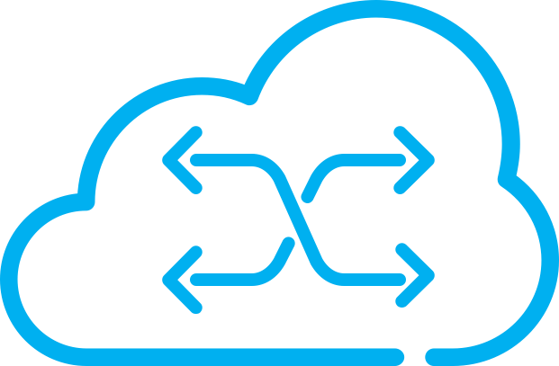
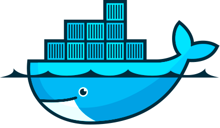
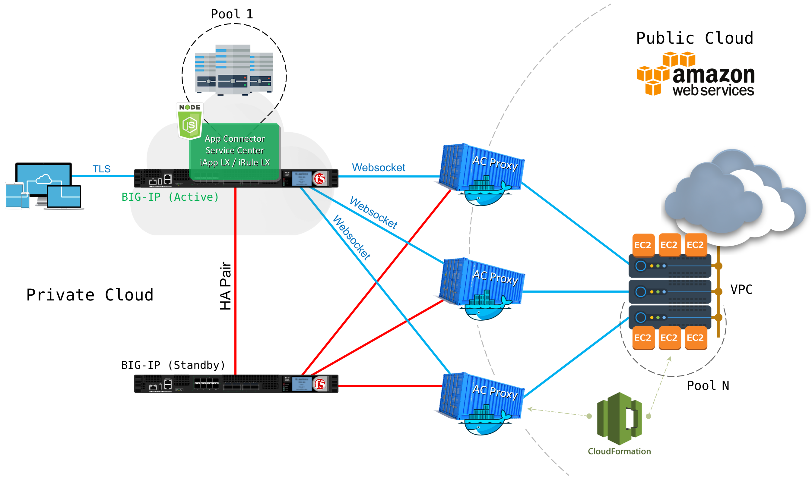

# &nbsp;&nbsp;F5 Application Connector&nbsp;&nbsp;

Based on a lab by [Thomas Stanley](https://github.com/tstanley93)

## Table of Contents
- [Description](#description)
- [Topology](#topology)
- [Installation](#installation)
	- [AWS CloudFormation](#aws-cloudformation)
- [License](LICENSE)

&nbsp;&nbsp;

## Description

F5 Networks Application Connector delivers secure and available application services from the edge of the cloud by automatically discovering public cloud-hosted instances and connecting them to the on-premises data center or hosted location.

&nbsp;&nbsp;

## Topology

&nbsp;&nbsp;

## Installation
### AWS CloudFormation

&nbsp;&nbsp;
